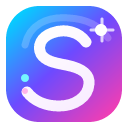
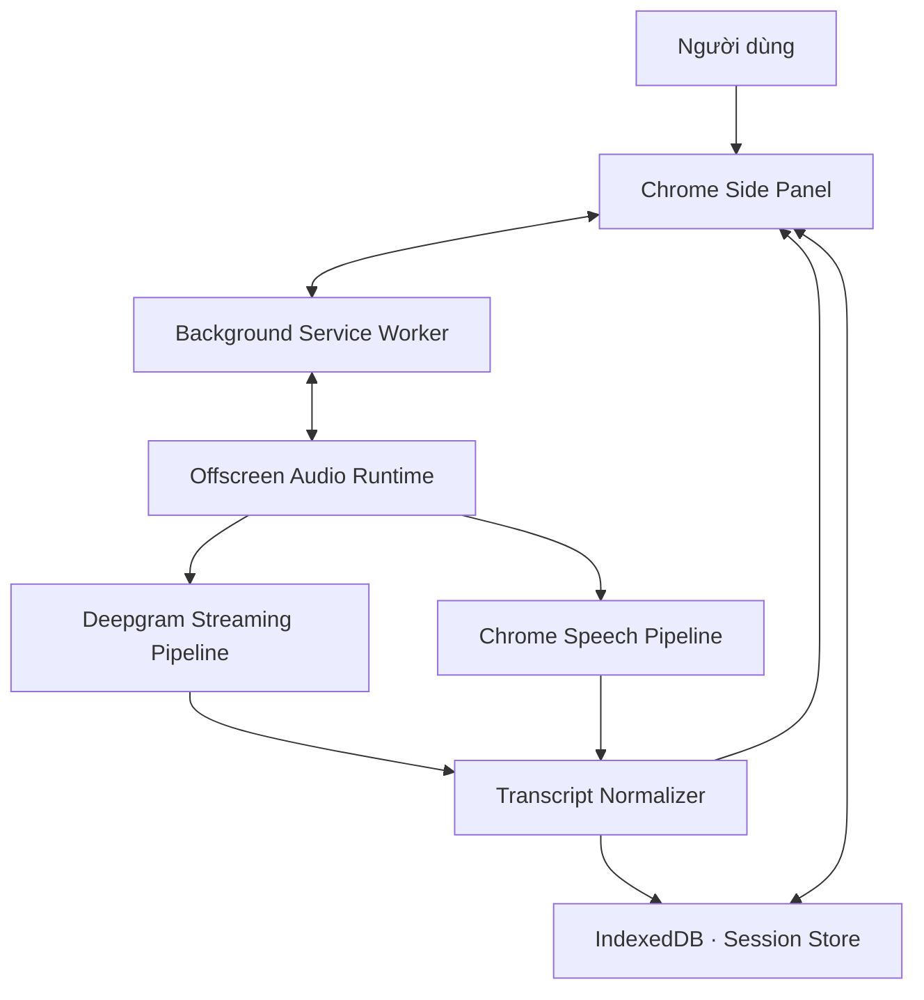
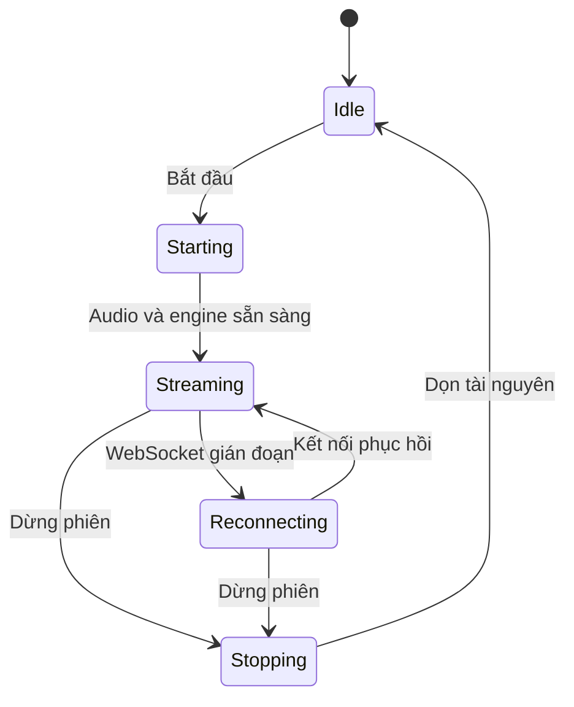
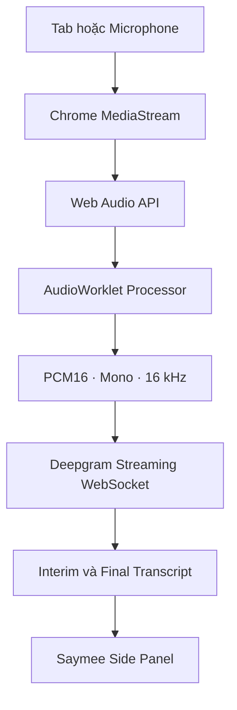
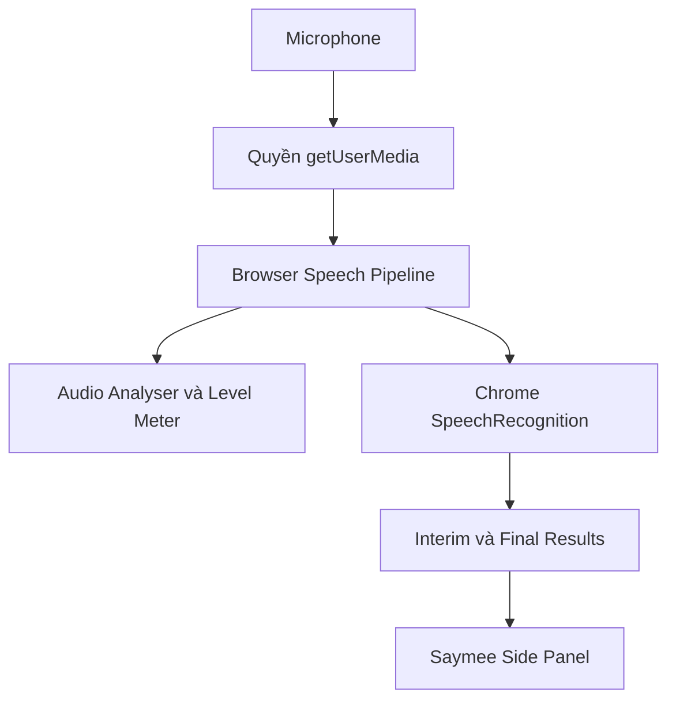

<!-- markdownlint-disable first-line-h1 -->
<!-- markdownlint-disable html -->

<div align="center">
  

  <h1>Saymee Live STT</h1>

  <p><strong>Real-time Speech-to-Text for Google Chrome</strong></p>
  <p>
    Chép lời trực tiếp từ âm thanh tab, microphone hoặc đồng thời cả hai nguồn<br/>
    bằng Deepgram Streaming STT và Chrome Web Speech API.
  </p>

  <p>
    
    
    
    
    
    <a href="./LICENSE"></a>
  </p>

  <p>
    <a href="#-cài-đặt"><b>📦 Cài đặt</b></a>
    ·
    <a href="#-bắt-đầu-nhanh"><b>🚀 Bắt đầu nhanh</b></a>
    ·
    <a href="#-kiến-trúc-hệ-thống"><b>🏗️ Kiến trúc</b></a>
    ·
    <a href="#-cấu-hình-deepgram"><b>🔐 Deepgram</b></a>
    ·
    <a href="#-xử-lý-sự-cố"><b>🧭 Xử lý sự cố</b></a>
  </p>
</div>

---

> [!NOTE]
> **Saymee Live STT v1.1.0** là Chrome Extension Manifest V3 dành cho chép lời thời gian thực. Đường hoạt động mặc định là **Deepgram + âm thanh tab + `activeTab`**; **Chrome Speech** là chế độ microphone phụ, không cần token server.

## ✨ Trải nghiệm Saymee

Saymee biến âm thanh đang phát trong trình duyệt thành văn bản trực tiếp ngay trong Side Panel của Chrome:

```text
Mở nội dung → Bấm Saymee → Chọn nguồn → Bắt đầu nhận dạng → Theo dõi transcript → Sao chép/Xuất dữ liệu
```

| | Khả năng nổi bật |
|---|---|
| 🎧 **Tab Audio Capture** | Thu trực tiếp âm thanh từ tab, không cần phát ra loa rồi thu lại bằng microphone |
| 🎙️ **Microphone STT** | Nhận giọng nói từ microphone bằng Deepgram hoặc Chrome Speech |
| 🔀 **Hai nguồn độc lập** | Chạy tab và microphone bằng hai pipeline riêng, có nhãn `TAB` và `MIC` |
| ⚡ **Streaming thời gian thực** | Hiển thị transcript tạm thời và hoàn chỉnh ngay khi đang nói |
| 👥 **Speaker Diarization** | Hiển thị người nói khi Deepgram trả dữ liệu diarization |
| 📊 **Live Telemetry** | Mức âm lượng, thời lượng, số đoạn, số từ và trạng thái từng nguồn |
| 🧰 **Chẩn đoán theo tầng** | Theo dõi MediaStream, AudioContext, AudioWorklet, PCM, token, WebSocket và transcript |
| 💾 **Khôi phục phiên cục bộ** | Final transcript được lưu bằng IndexedDB và nạp lại khi Side Panel mở lại |
| 📄 **Xuất dữ liệu tiêu chuẩn** | Sao chép hoặc xuất TXT, JSON, SRT và WebVTT với Unicode, metadata và timestamp |

### Trường hợp sử dụng

| Lĩnh vực | Ứng dụng |
|---|---|
| Họp trực tuyến | Tạo bản chép lời nháp cho Google Meet, Zoom Web và Microsoft Teams Web |
| Giáo dục | Theo dõi bài giảng, webinar, hội thảo hoặc nội dung học trực tuyến |
| Phỏng vấn và nghiên cứu | Ghi lại lời người tham gia và câu hỏi từ microphone |
| Nội dung số | Tạo bản thô cho phụ đề video, podcast, livestream và nội dung mạng xã hội |
| Ghi chú cá nhân | Chuyển lời nói thành văn bản ngay trong trình duyệt |
| Hỗ trợ tiếp cận | Bổ sung lớp văn bản trực tiếp cho nội dung có lời nói |
| Chăm sóc khách hàng | Tạo transcript nháp cho cuộc gọi chạy trong ứng dụng web |
| Theo dõi truyền thông | Thu lời nói từ nguồn phát web để tìm kiếm và tổng hợp sau phiên |

> [!IMPORTANT]
> Transcript do STT tạo ra có thể cần hiệu đính. Không sử dụng kết quả chưa kiểm tra làm hồ sơ chính thức trong các tình huống pháp lý, y tế, tài chính hoặc an toàn.

## 🧭 Mục lục

- [Trải nghiệm Saymee](#-trải-nghiệm-saymee)
- [Kiến trúc hệ thống](#-kiến-trúc-hệ-thống)
- [Hai công nghệ nhận dạng](#-hai-công-nghệ-nhận-dạng)
- [Nền tảng công nghệ](#-nền-tảng-công-nghệ)
- [Yêu cầu hệ thống](#-yêu-cầu-hệ-thống)
- [Cài đặt](#-cài-đặt)
- [Bắt đầu nhanh](#-bắt-đầu-nhanh)
- [Cấu hình Deepgram](#-cấu-hình-deepgram)
- [Transcript và dữ liệu đầu ra](#-transcript-và-dữ-liệu-đầu-ra)
- [Quyền riêng tư và bảo mật](#-quyền-riêng-tư-và-bảo-mật)
- [Quyền của extension](#-quyền-của-extension)
- [Xử lý sự cố](#-xử-lý-sự-cố)
- [Cấu trúc dự án](#-cấu-trúc-dự-án)
- [Phát triển và kiểm thử](#-phát-triển-và-kiểm-thử)
- [Tương thích Saydi](#-tương-thích-saydi)
- [Giấy phép và tác giả](#-giấy-phép-và-tác-giả)

## 🏗️ Kiến trúc hệ thống

Saymee tách giao diện, điều phối trình duyệt và runtime xử lý âm thanh thành các lớp độc lập. MediaStream, AudioContext và WebSocket được giữ trong Offscreen Document để phiên STT không phụ thuộc vòng đời của Side Panel.



### Vai trò từng lớp

| Lớp | Tệp chính | Trách nhiệm |
|---|---|---|
| **Presentation** | `sidepanel.html`, `sidepanel.css`, `sidepanel.js` | Cấu hình phiên, trạng thái nguồn, transcript, export đa định dạng và chẩn đoán |
| **Browser orchestration** | `background.js` | Side Panel API, tab context, `activeTab`, stream ID, Offscreen Document và message routing |
| **Audio/STT runtime** | `offscreen.html`, `offscreen.js` | MediaStream, AudioContext, Deepgram WebSocket, Chrome Speech, reconnect và dọn tài nguyên |
| **Audio processing** | `audio-worklet.js` | Mono downmix, resample và tạo PCM16 ở 16 kHz |
| **Transcript core** | `transcript-core.mjs` | Session, normalized event, dedupe, media timestamp và export TXT/JSON/SRT/VTT |
| **Local persistence** | `transcript-store.mjs` | IndexedDB `saymee-db` với object store `sessions` và `segments` |
| **Permission flow** | `permission.html`, `permission.js` | Xin quyền microphone từ extension origin |
| **Credential broker mẫu** | `server/token-server.mjs` | Đổi Deepgram API key phía máy chủ lấy temporary access token |

### Vòng đời một phiên



Saymee chỉ hiển thị **Đang nghe** sau khi pipeline tương ứng đã khởi động. Mỗi phiên có ID và metadata độc lập với UI. Final transcript được ghi vào IndexedDB; interim chỉ nằm trong RAM/UI. Khi dừng, runtime đóng MediaStream tracks, AudioWorklet, AudioContext, WebSocket và timer thuộc phiên.

## 🧠 Hai công nghệ nhận dạng

### 1. Deepgram Streaming STT — đường hoạt động chính

Deepgram nhận audio tuyến tính từ tab, microphone hoặc cả hai nguồn. Saymee xử lý audio trong trình duyệt trước khi truyền qua WebSocket.



Đường dữ liệu thực tế:

```text
chrome.tabCapture / chrome.desktopCapture / getUserMedia
→ MediaStream
→ AudioContext
→ AudioWorkletNode
→ linear16 · 16 kHz · mono
→ wss://api.deepgram.com/v1/listen
→ transcript event
→ Side Panel
```

Thông số nhận dạng chính được mã hiện tại sử dụng:

| Tham số | Giá trị |
|---|---|
| Model | `nova-3` |
| Encoding | `linear16` |
| Sample rate | `16000` Hz |
| Channels | `1` |
| Ngôn ngữ mặc định | `vi` |
| Định dạng thông minh | `smart_format=true` |
| Dấu câu | `punctuate=true` |
| Kết quả tạm thời | `interim_results=true` |
| Voice activity | `vad_events=true` |
| Diarization | Có thể bật cho nguồn tab |

Khi capture âm thanh tab, Saymee nối stream trở lại `AudioContext.destination` để người dùng vẫn nghe nội dung trong lúc nhận dạng.

### 2. Chrome Speech — Web Speech API cho microphone

Chrome Speech sử dụng `SpeechRecognition` hoặc `webkitSpeechRecognition` do trình duyệt cung cấp. Chế độ này chỉ dành cho microphone và không dùng Deepgram.



Chế độ Chrome Speech:

- không dùng `tabCapture`;
- không dùng AudioWorklet để truyền PCM;
- không mở Deepgram WebSocket;
- không cần token server hoặc Deepgram API key;
- phụ thuộc khả năng Web Speech API, chính sách Chrome và kết nối của trình duyệt;
- có thể sử dụng dịch vụ nhận dạng trực tuyến do trình duyệt cung cấp.

### So sánh hai engine

| Tiêu chí | Deepgram | Chrome Speech |
|---|---|---|
| Nguồn tab | ✅ | — |
| Microphone | ✅ | ✅ |
| Tab + microphone | ✅ | — |
| Temporary token/API key | Cần | Không cần |
| AudioWorklet + PCM16 | Có | Không |
| Streaming WebSocket | Có | Do trình duyệt quản lý |
| Đa ngôn ngữ | Có tùy cấu hình | Bị giới hạn theo Web Speech |
| Diarization | Có khi dịch vụ trả dữ liệu | Không |
| Phạm vi hỗ trợ | Chrome/Chromium có đủ Extension APIs | Phụ thuộc bản dựng và chính sách trình duyệt |

> [!TIP]
> Dùng **Deepgram** khi cần âm thanh tab, hai nguồn hoặc pipeline có khả năng chẩn đoán chi tiết. Dùng **Chrome Speech** khi chỉ cần microphone và muốn bắt đầu nhanh mà không cấu hình token.

## 🧩 Nền tảng công nghệ

| Công nghệ/API | Vai trò trong Saymee |
|---|---|
| **Chrome Extension Manifest V3** | Mô hình đóng gói, quyền và Content Security Policy |
| **Side Panel API** | Giao diện STT cố định bên cạnh nội dung web |
| **`activeTab` + `tabCapture`** | Thu nhanh âm thanh của tab đang được người dùng kích hoạt |
| **Desktop Capture API** | Hộp chọn tab dự phòng khi cần chọn nguồn khác |
| **Offscreen API** | Duy trì runtime âm thanh ngoài vòng đời Side Panel |
| **Media Capture and Streams** | `getUserMedia()` cho microphone và MediaStream |
| **Web Audio API** | AudioContext, analyser, routing và phát lại âm thanh tab |
| **AudioWorklet** | Xử lý audio ngoài main UI thread và tạo PCM16 |
| **WebSocket** | Truyền audio streaming và nhận kết quả Deepgram |
| **Web Speech API** | `SpeechRecognition` cho chế độ Chrome Speech |
| **Chrome Storage API** | Lưu cấu hình và API key theo lựa chọn người dùng |
| **IndexedDB** | Lưu session metadata và toàn bộ final transcript ở máy người dùng |

## ⚙️ Cấu hình mặc định

Mọi bản cài mới bắt đầu với:

```js
{
  engine: 'deepgram',
  source: 'tab',
  tabCaptureMode: 'active_tab',
  language: 'vi',
  model: 'nova-3'
}
```

Các nguyên tắc không hồi quy:

1. **Deepgram + Tab + `activeTab`** là cấu hình mặc định.
2. **Chrome Speech chỉ nhận microphone.**
3. Saymee không tự chuyển engine hoặc nguồn âm thanh khi xảy ra lỗi.
4. Hồ sơ Deepgram được giữ khi người dùng tạm chuyển sang Chrome Speech.
5. Bản nâng cấp vẫn đọc được khóa cấu hình Saydi cũ.

## 🖥️ Yêu cầu hệ thống

- Google Chrome hoặc trình duyệt Chromium có các API Manifest V3 tương ứng.
- Chrome 116 trở lên.
- Trang HTTP/HTTPS nếu cần capture âm thanh tab.
- Tài khoản Deepgram cho engine Deepgram.
- Node.js 18 trở lên nếu chạy token server mẫu.

Chrome không cho extension capture trực tiếp:

- `chrome://`;
- Chrome Web Store;
- trang cài đặt hoặc trang tab mới;
- một số trang nội bộ và trang hệ thống.

## 📦 Cài đặt

### Tải từ GitHub

1. Mở [Base27-CVNSS/saymee](https://github.com/Base27-CVNSS/saymee).
2. Chọn **Code → Download ZIP**.
3. Giải nén tệp ZIP.
4. Mở `chrome://extensions`.
5. Bật **Chế độ dành cho nhà phát triển**.
6. Chọn **Tải tiện ích đã giải nén**.
7. Chọn thư mục chứa `manifest.json`.
8. Ghim **Saymee Live STT** lên thanh công cụ.

### Cập nhật bản Load unpacked

Để giữ extension ID, quyền microphone và cấu hình:

1. Dừng phiên Saymee đang chạy.
2. Chép mã mới vào đúng thư mục Chrome đang tải.
3. Mở `chrome://extensions`.
4. Bấm **Tải lại** trên thẻ Saymee.
5. Đóng rồi mở lại Side Panel.

> [!WARNING]
> Nếu tải extension từ một thư mục mới, Chrome có thể tạo extension ID khác. Extension ID mới không dùng chung quyền microphone, `chrome.storage` hoặc session token của bản cũ.

## 🚀 Bắt đầu nhanh

### A. Chép lời tab hiện tại bằng Deepgram

Đây là trải nghiệm mặc định:

1. Mở tab đang phát âm thanh.
2. Bấm biểu tượng **Saymee Live STT** trên chính tab đó.
3. Giữ **Deepgram → Tab hiện tại → activeTab**.
4. Cấu hình temporary token hoặc API key.
5. Bấm **Bắt đầu nhận dạng**.
6. Theo dõi mức âm lượng `TAB` và transcript trực tiếp.
7. Bấm **Dừng phiên** khi hoàn tất.

Quyền `activeTab` có tính tạm thời. Sau khi chuyển tab hoặc điều hướng sang origin khác, hãy bấm lại biểu tượng Saymee trên tab cần ghi.

### B. Chọn tab bằng hộp thoại Chrome

Dùng khi `activeTab` hết hiệu lực hoặc muốn chọn một tab khác:

1. Chọn **Deepgram**.
2. Chọn **Tab hiện tại** hoặc **Tab + Microphone**.
3. Chọn **Hộp chọn tab của Chrome — phương án dự phòng**.
4. Bấm **Bắt đầu nhận dạng**.
5. Chọn đúng tab.
6. Bật **Chia sẻ âm thanh tab** rồi xác nhận.

Desktop Capture chỉ thay cách lấy MediaStream; engine nhận dạng vẫn là Deepgram.

### C. Chép lời microphone bằng Chrome Speech

1. Bấm biểu tượng Saymee.
2. Chọn **Chrome Speech — microphone, không cần API**.
3. Bấm **Cấp quyền microphone**.
4. Chọn **Cho phép** trong trang quyền.
5. Bấm **Bắt đầu nhận dạng**.

### D. Chép lời tab và microphone đồng thời

1. Chọn **Deepgram**.
2. Chọn **Tab + Microphone**.
3. Chọn `activeTab` hoặc hộp chọn tab.
4. Cấp quyền microphone.
5. Kiểm tra thông tin xác thực Deepgram.
6. Bấm **Bắt đầu nhận dạng**.

Hai nguồn chạy bằng pipeline độc lập. Nếu một nguồn gặp lỗi, nguồn còn lại có thể tiếp tục khi runtime của nguồn đó vẫn hoạt động.

## 🔐 Cấu hình Deepgram

### Temporary token — khuyến nghị

Không nhúng API key Deepgram dài hạn vào extension hoặc kho Git công khai. Thư mục `server` cung cấp credential broker mẫu cho phát triển cục bộ.

#### Windows PowerShell

```powershell
cd server
$env:DEEPGRAM_API_KEY="YOUR_DEEPGRAM_API_KEY"
npm start
```

#### macOS hoặc Linux

```bash
cd server
DEEPGRAM_API_KEY="YOUR_DEEPGRAM_API_KEY" npm start
```

Endpoint mặc định:

```text
http://127.0.0.1:8787/token
```

Health check:

```text
http://127.0.0.1:8787/health
```

Trong Saymee:

1. Mở **Thiết lập kết nối Deepgram**.
2. Chọn **Temporary token — khuyến nghị**.
3. Nhập `http://127.0.0.1:8787/token`.
4. Bấm **Kiểm tra**.
5. Bắt đầu nhận dạng khi kết nối hợp lệ.

Trong môi trường production, token endpoint cần HTTPS, xác thực người dùng, quota, rate limiting, CORS phù hợp và tuyệt đối không log transcript hoặc thông tin xác thực.

### API key trực tiếp — chỉ dùng cục bộ

1. Chọn **API key — chỉ dùng cục bộ**.
2. Dán Deepgram API key.
3. Chỉ bật **Lưu API key trên máy này** nếu chấp nhận lưu key trong `chrome.storage.local`.

Nếu không bật lưu, API key chỉ nằm trong `chrome.storage.session` và mất khi phiên trình duyệt kết thúc.

Không:

- ghi API key vào mã nguồn;
- commit `.env`;
- đóng gói key trong ZIP phát hành;
- đưa key hoặc token vào báo cáo chẩn đoán;
- chia sẻ ảnh chụp màn hình có thông tin xác thực.

## 📄 Transcript và dữ liệu đầu ra

| Chức năng | Kết quả |
|---|---|
| **Sao chép** | Đưa toàn bộ transcript hoàn chỉnh vào clipboard |
| **Xuất TXT** | Tạo tệp UTF-8 có BOM để hiển thị đúng tiếng Việt trên Windows |
| **Xuất JSON** | Giữ session metadata cùng schema đầy đủ: engine, source, timestamp, speaker và confidence |
| **Xuất SRT** | Tạo phụ đề dùng media timeline với dấu phân cách millisecond dạng dấu phẩy |
| **Xuất WebVTT** | Tạo phụ đề `WEBVTT` dùng media timeline với dấu phân cách millisecond dạng dấu chấm |
| **Xóa** | Xóa transcript của phiên hiện tại khỏi UI, cache runtime và IndexedDB |
| **Nhãn nguồn** | `TAB` cho âm thanh tab, `MIC` cho microphone |
| **Nhãn người nói** | Hiển thị khi Deepgram cung cấp speaker diarization |
| **Thời gian** | Phân biệt media timeline cho phụ đề và wall clock cho lịch sử/diagnostics |

Saymee không tự lưu audio và không đồng bộ transcript lên cloud. Final transcript được lưu cục bộ trong IndexedDB của extension để Side Panel có thể khôi phục phiên; dữ liệu này vẫn thuộc profile Chrome hiện tại.

## 🛡️ Quyền riêng tư và bảo mật

- Saymee chỉ bắt đầu thu khi người dùng chủ động bấm **Bắt đầu nhận dạng**.
- Với Deepgram, audio được gửi trực tiếp đến dịch vụ Deepgram để nhận dạng.
- Với Chrome Speech, audio được xử lý theo cơ chế Web Speech của trình duyệt và có thể sử dụng dịch vụ trực tuyến do Chrome cung cấp.
- Token server mẫu chỉ cấp thông tin xác thực; nó không nhận audio từ Saymee.
- Nhật ký kỹ thuật không chứa API key, temporary token hoặc nội dung xác thực.
- Bấm **Dừng phiên** sẽ đóng audio tracks, AudioContext và WebSocket.
- Final transcript được lưu cục bộ trong IndexedDB; nút **Xóa** xóa các segment của phiên hiện tại.
- Kho mã không chứa API key hoặc token dựng sẵn.

> [!CAUTION]
> Trước khi chép lời cuộc họp hoặc người khác, người dùng phải tuân thủ quy định về thông báo, đồng ý ghi âm, dữ liệu cá nhân và chính sách của tổ chức.

## 🔑 Quyền của extension

| Quyền | Vì sao Saymee cần quyền này? |
|---|---|
| `activeTab` | Nhận quyền tạm thời trên tab vừa được người dùng kích hoạt |
| `tabCapture` | Lấy âm thanh trực tiếp từ tab hiện tại |
| `desktopCapture` | Mở hộp chọn tab dự phòng của Chrome |
| `offscreen` | Duy trì MediaStream, AudioContext và WebSocket ngoài Side Panel |
| `sidePanel` | Hiển thị giao diện Saymee cạnh nội dung web |
| `storage` | Lưu cấu hình và lựa chọn lưu API key |
| `https://api.deepgram.com/*` | Kết nối Deepgram Streaming API |
| `localhost` / `127.0.0.1` | Kết nối token server cục bộ |

Token endpoint HTTPS từ xa chỉ được xin quyền theo origin khi người dùng chủ động cấu hình.

## 🧭 Xử lý sự cố

<details>
<summary><b>Extension chưa được kích hoạt trên tab</b></summary>

- Đưa đúng tab cần ghi lên trước.
- Bấm biểu tượng Saymee trên chính tab đó.
- Nếu quyền `activeTab` không còn hiệu lực, dùng hộp chọn tab của Chrome.

</details>

<details>
<summary><b>Không có âm thanh tab</b></summary>

- Bảo đảm tab đang thực sự phát âm thanh.
- Với Desktop Capture, chọn đúng tab và bật **Chia sẻ âm thanh tab**.
- Không capture trang `chrome://` hoặc Chrome Web Store.
- Mở **Chẩn đoán kỹ thuật** để kiểm tra MediaStream và AudioContext.

</details>

<details>
<summary><b>Token server không phản hồi</b></summary>

- Bảo đảm `npm start` vẫn đang chạy.
- Mở `http://127.0.0.1:8787/health`.
- Kiểm tra biến môi trường `DEEPGRAM_API_KEY`.
- Kiểm tra đúng token endpoint.
- Với endpoint từ xa, sử dụng HTTPS.

</details>

<details>
<summary><b>Deepgram từ chối WebSocket</b></summary>

- Kiểm tra API key hoặc temporary token.
- Kiểm tra hạn mức và trạng thái tài khoản Deepgram.
- Kiểm tra mạng, proxy và firewall.
- Dùng nút **Kiểm tra** trước khi bắt đầu phiên.

</details>

<details>
<summary><b>Microphone đã cấp quyền nhưng không có chữ</b></summary>

- Kiểm tra microphone mặc định của Chrome và hệ điều hành.
- Nói gần microphone và quan sát thanh mức âm lượng.
- Tải lại extension sau khi cập nhật mã.
- Nếu Chrome Speech bị chính sách trình duyệt chặn, thử **Deepgram + Microphone**.

</details>

### Trình tự chẩn đoán Deepgram

```text
MediaStream
→ AudioContext
→ AudioWorklet
→ Gói PCM đầu tiên
→ Xác thực
→ Deepgram WebSocket
→ Transcript đầu tiên
```

Mở **Chẩn đoán kỹ thuật → Kiểm tra lại API**, bắt đầu một phiên rồi tìm tầng đầu tiên chuyển sang lỗi. Nút **Sao chép nhật ký** tạo báo cáo không chứa API key hoặc token.

## 📁 Cấu trúc dự án

```text
.
├── manifest.json
├── background.js
├── sidepanel.html
├── sidepanel.css
├── sidepanel.js
├── offscreen.html
├── offscreen.js
├── audio-worklet.js
├── transcript-core.mjs
├── transcript-store.mjs
├── permission.html
├── permission.js
├── icons/
│   ├── icon.svg
│   ├── icon16.png
│   ├── icon32.png
│   ├── icon48.png
│   └── icon128.png
├── server/
│   ├── package.json
│   └── token-server.mjs
├── tests/
│   ├── smoke.mjs
│   ├── transcript-core.mjs
│   ├── recovery.mjs
│   └── regression.mjs
└── LICENSE
```

## 🧪 Phát triển và kiểm thử

Kiểm tra cú pháp:

```bash
node --check background.js
node --check sidepanel.js
node --check offscreen.js
node --check audio-worklet.js
node --check permission.js
node --check transcript-core.mjs
node --check transcript-store.mjs
node --check server/token-server.mjs
```

Chạy test:

```bash
node tests/smoke.mjs
node tests/transcript-core.mjs
node tests/recovery.mjs
node tests/regression.mjs
```

Trước khi phát hành, cần kiểm tra thực tế:

- YouTube bằng `activeTab`;
- YouTube bằng Desktop Capture;
- người dùng không bật chia sẻ âm thanh;
- tab bị đóng khi đang ghi;
- microphone bị từ chối quyền;
- Chrome Speech không có tiếng nói;
- token server không chạy;
- token sai hoặc hết hạn;
- mất mạng và reconnect;
- Start/Stop nhiều lần;
- đóng/mở Side Panel trong khi đang nhận dạng;
- phiên dài trên 1.000 final segment và export đủ bốn định dạng;
- chạy liên tục ít nhất 30 phút;
- nâng cấp từ Saydi mà không mất cấu hình.

Smoke test không thay thế kiểm thử end-to-end trong Google Chrome.

## 🔄 Tương thích Saydi

Saymee sử dụng khóa mới:

```text
saymeeLiveSettings
saymeeSessionApiKey
```

Để nâng cấp an toàn, Saymee vẫn đọc:

```text
saydiLiveSettings
saydiSessionApiKey
```

Khi tìm thấy cấu hình cũ mà chưa có cấu hình mới, Saymee migration dữ liệu sang khóa Saymee và không xóa khóa cũ.

## 📌 Phạm vi phiên bản hiện tại

Saymee v1.1.0 tập trung vào **Speech-to-Text thời gian thực**. Phiên bản hiện tại chưa cung cấp:

- dịch máy;
- tóm tắt tự động;
- lưu audio;
- đồng bộ transcript lên cloud.

Độ chính xác phụ thuộc chất lượng âm thanh, ngôn ngữ, người nói, engine, mạng và hạn mức dịch vụ.

## 🤝 Ghi nhận công nghệ

Saymee được xây dựng trên các nền tảng và tiêu chuẩn web:

- [Google Chrome Extensions](https://developer.chrome.com/docs/extensions/);
- [Deepgram](https://deepgram.com/) cho Streaming Speech-to-Text;
- Web Audio API, AudioWorklet, MediaStream và WebSocket;
- Web Speech API của trình duyệt.

Tên thương hiệu và dịch vụ bên thứ ba thuộc chủ sở hữu tương ứng. Saymee là dự án độc lập, không phải sản phẩm chính thức của Google Chrome hoặc Deepgram.

## 📜 Giấy phép và tác giả

Saymee Live STT được phát hành theo giấy phép [MIT](./LICENSE).

```text
Copyright (c) 2026 Long Ngo
```

**Phát triển bởi Long Ngo** · [Base27-CVNSS](https://github.com/Base27-CVNSS)

---

<div align="center">
  
  <p><strong>Saymee Live STT</strong></p>
  <p>Listen. Transcribe. Keep the conversation.</p>
  <p>
    <a href="https://github.com/Base27-CVNSS/saymee">Repository</a>
    ·
    <a href="https://github.com/Base27-CVNSS/saymee/issues">Issues</a>
    ·
    <a href="./LICENSE">MIT License</a>
  </p>
</div>
